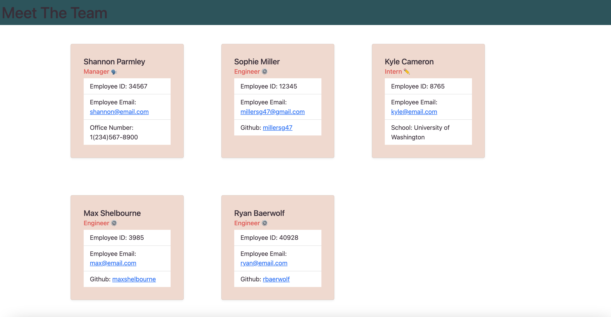

# Team Profile Generator

## Table of Contents

- [Description](#description)
- [Installation](#installation)
- [Usage](#usage)
- [Contributing](#contributing)
- [Tests](#tests)
- [License](#license)
- [Questions](#questions)

## Description

This is a javascript application set up to run in Node.js. It takes in user inputs and builds an html file to display the user's team members' profiles in a clean ui.

## Installation

To install this application, clone the repo from Github to your local machine. Open the command line and install the npm dependencies, then run with node.

## Usage

The use case for this application is to build a browser friendly file (html) that displays the user's input data for their team members.
[Walkthrough video](https://youtu.be/i7-6c9HaPSw)

## Contributing

To contribute, clone the repo to your local machine, open a new branch and write your code. Then request to merge your branch into the main branch for review.

## Tests

To run tests, make sure to first install the npm dependecies including jest. Then run 'npm test' in your command line to perform the tests.

## License

    MIT

## Questions

- [GitHub profile](https://github.com/millersg47)
- Contact Me at millersg47@gmail.com with additional questions
